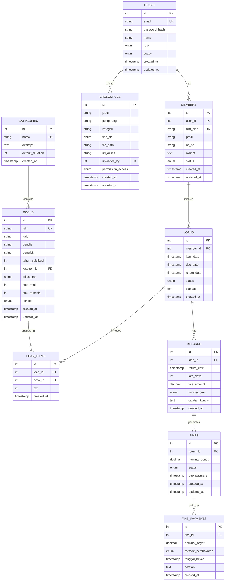

# ERD (Entity Relationship Diagram) - Mermaid Format

## ERD Diagram Lengkap



---

## Entity Relationship Explanation

### 1. USERS (Pengguna Sistem)
**Deskripsi**: Menyimpan informasi akun pengguna sistem dengan role dan status.

**Relasi**:
- 1 User : N Members (one-to-many) - Satu akun user bisa memiliki satu profil member
- 1 User : N E-Resources (uploads) - Satu user bisa upload banyak e-resource

**Role Options**:
- `admin` - Full access ke seluruh sistem
- `pustakawan` - Access ke sirkulasi dan manajemen
- `member` - Access terbatas untuk member

---

### 2. MEMBERS (Anggota Perpustakaan)
**Deskripsi**: Menyimpan informasi detail anggota perpustakaan (mahasiswa/dosen).

**Relasi**:
- N Members : 1 User (one-to-many) - Setiap member terhubung dengan satu user account
- 1 Member : N Loans (one-to-many) - Satu member bisa pinjam banyak kali

**Status Options**:
- `aktif` - Member aktif dapat meminjam
- `non_aktif` - Member tidak aktif
- `suspend` - Member di-suspend (ada tunggakan)

---

### 3. CATEGORIES (Kategori Buku)
**Deskripsi**: Master data untuk klasifikasi/kategori buku.

**Relasi**:
- 1 Category : N Books (one-to-many) - Satu kategori memiliki banyak buku

**Contoh Kategori**:
- Fiksi
- Non-Fiksi
- Referensi
- Jurnal
- Skripsi
- Teknologi, dsb

---

### 4. BOOKS (Koleksi Buku)
**Deskripsi**: Menyimpan metadata dan stok buku perpustakaan.

**Relasi**:
- N Books : 1 Category (many-to-one)
- 1 Book : N Loan_Items (one-to-many) - Satu buku bisa dipinjam di banyak transaksi

**Atribut Penting**:
- `isbn` - Identifier unik buku
- `stok_tersedia` - Update otomatis saat pinjam/kembali
- `lokasi_rak` - Format A-01-03 (area-row-col)

---

### 5. LOANS (Transaksi Peminjaman)
**Deskripsi**: Mencatat setiap transaksi peminjaman dengan due date.

**Relasi**:
- N Loans : 1 Member (many-to-one)
- 1 Loan : N Loan_Items (one-to-many)
- 1 Loan : 0..1 Returns (one-to-one atau null)

**Status Options**:
- `active` - Peminjaman masih berlaku
- `returned` - Sudah dikembalikan
- `overdue` - Terlambat

---

### 6. LOAN_ITEMS (Detail Item Peminjaman)
**Deskripsi**: Menyimpan detail buku apa saja yang dipinjam dalam satu transaksi.

**Relasi**:
- N Loan_Items : 1 Loan (many-to-one)
- N Loan_Items : 1 Book (many-to-one)

**Constraint**: Satu buku hanya bisa muncul 1x dalam 1 transaksi (UNIQUE loan_id + book_id)

---

### 7. RETURNS (Transaksi Pengembalian)
**Deskripsi**: Mencatat pengembalian buku dan otomatis menghitung denda keterlambatan.

**Relasi**:
- N Returns : 1 Loan (many-to-one)
- 1 Return : N Fines (one-to-many) atau 0 Fines jika on-time

**Perhitungan Denda Otomatis**:
```
IF return_date > due_date THEN
    late_days = DATEDIFF(return_date, due_date)
    fine_amount = late_days × Rp 5.000
ELSE
    fine_amount = 0
END IF
```

---

### 8. FINES (Data Denda)
**Deskripsi**: Menyimpan data denda dari keterlambatan dengan status pembayaran.

**Relasi**:
- N Fines : 1 Return (many-to-one)
- 1 Fine : N Fine_Payments (one-to-many)

**Status Options**:
- `unpaid` - Belum dibayar
- `partial` - Dibayar sebagian
- `paid` - Lunas

---

### 9. FINE_PAYMENTS (Pembayaran Denda)
**Deskripsi**: Mencatat setiap pembayaran denda dari member.

**Relasi**:
- N Fine_Payments : 1 Fine (many-to-one)

**Metode Pembayaran**:
- `tunai` - Pembayaran tunai
- `cheque` - Via cheque
- `transfer` - Transfer bank (untuk future)

---

### 10. ERESOURCES (E-Resources)
**Deskripsi**: Menyimpan file e-book, jurnal, dan resource digital lainnya.

**Relasi**:
- N EResources : 1 User (uploaded_by)

**Tipe File**:
- `pdf` - PDF document
- `epub` - E-book format
- `mobi` - Mobi format
- `doc` - Word document
- `link` - External link (URL)

**Permission Options**:
- `public` - Akses publik
- `member_only` - Hanya untuk member
- `admin_only` - Hanya untuk admin

---

## Cardinality & Relationships

### Tabel Relasi

| From | To | Cardinality | Type | Delete Rule |
|------|----|----|------|-------------|
| USERS | MEMBERS | 1:N | has | CASCADE |
| USERS | ERESOURCES | 1:N | uploads | SET NULL |
| CATEGORIES | BOOKS | 1:N | contains | RESTRICT |
| MEMBERS | LOANS | 1:N | initiates | RESTRICT |
| LOANS | LOAN_ITEMS | 1:N | includes | CASCADE |
| BOOKS | LOAN_ITEMS | 1:N | appears_in | RESTRICT |
| LOANS | RETURNS | 1:1 | has | RESTRICT |
| RETURNS | FINES | 1:N | generates | RESTRICT |
| FINES | FINE_PAYMENTS | 1:N | paid_by | RESTRICT |

### Cardinality Legend
- `1:1` - One-to-One (unique relationship)
- `1:N` - One-to-Many (most common)
- `N:N` - Many-to-Many (using junction table)

---

## Data Flow Illustration

```
┌─────────────────────────────────────────────────────────────┐
│ ALUR DATA PERPUSTAKAAN DIGITAL                              │
└─────────────────────────────────────────────────────────────┘

1. REGISTRASI MEMBER
   ┌─────────┐
   │  LOGIN  │ (email + password)
   └────┬────┘
        │
        v
   ┌──────────┐       ┌─────────┐
   │ USERS    │────→  │ MEMBERS │ (nim_nidn, prodi, no_hp)
   │ (created)│       │ (created)│
   └──────────┘       └─────────┘

2. PENCARIAN BUKU (OPAC)
   ┌──────────────┐
   │ MEMBERS      │ Search query
   └────┬─────────┘
        │
        v
   ┌──────────────────────────┐
   │ CATEGORIES ← BOOKS       │
   │ (filter by kategori)     │
   │ (index: judul, penulis)  │
   └──────────────────────────┘

3. PEMINJAMAN BUKU
   ┌──────────────┐
   │ MEMBERS      │ Inisiasi peminjaman
   └────┬─────────┘
        │
        v
   ┌──────────────────────┐
   │ LOANS (created)      │ loan_date, due_date
   └────┬─────────────────┘
        │
        v
   ┌──────────────────────┐
   │ LOAN_ITEMS (created) │ book_id, qty
   └────┬─────────────────┘
        │
        v
   ┌──────────────────────┐
   │ BOOKS (updated)      │ stok_tersedia - 1
   └──────────────────────┘

4. PENGEMBALIAN & PERHITUNGAN DENDA
   ┌──────────────┐
   │ LOANS        │ status: active → returned
   │ (return_date)│
   └────┬─────────┘
        │
        v
   ┌──────────────────────┐
   │ RETURNS (created)    │ late_days, fine_amount
   └────┬─────────────────┘
        │
        v
   IF late_days > 0 THEN
   ┌──────────────────────┐
   │ FINES (created)      │ status: unpaid
   │ (auto-triggered)     │
   └──────────────────────┘

5. PEMBAYARAN DENDA
   ┌──────────────┐
   │ FINES        │ status: unpaid → partial/paid
   └────┬─────────┘
        │
        v
   ┌──────────────────────┐
   │ FINE_PAYMENTS        │ nominal_bayar, metode
   │ (created)            │
   └──────────────────────┘

6. UPLOAD E-RESOURCES
   ┌──────────────┐
   │ USERS (admin)│ Upload file
   └────┬─────────┘
        │
        v
   ┌──────────────────────┐
   │ ERESOURCES (created) │ file_path, permission
   │                      │
   └──────────────────────┘
```

---

## Normalization Analysis

### 1st Normal Form (1NF) - Atomic Values ✅
Semua atribut mengandung nilai tunggal (atomic), tidak ada repeating groups.

**Contoh**:
```
BOOKS tabel tidak memiliki field multi-value
Benar: penulis = "John Doe" (tunggal)
Salah: penulis = "John Doe, Jane Smith" (multi-value)
```

### 2nd Normal Form (2NF) - Full Dependency ✅
Semua non-key attributes fully dependent pada primary key.

**Contoh**:
```
BOOKS tabel:
- isbn PK
- judul, penulis, kategori_id → depend pada isbn (PK)
✓ Tidak ada partial dependency
```

### 3rd Normal Form (3NF) - No Transitive Dependency ✅
Tidak ada transitive dependency antara non-key attributes.

**Contoh**:
```
BOOKS tabel:
- kategori_id → CATEGORIES tabel (separate)
✓ Deskripsi kategori tidak disimpan di BOOKS (avoid redundancy)
```

### Boyce-Codd Normal Form (BCNF) ✅
Setiap determinant adalah candidate key.

---

## Indexing Strategy for Performance

### Indexes yang Diperlukan

| Table | Column | Type | Reason |
|-------|--------|------|--------|
| USERS | email | UNIQUE | Login, avoid duplicates |
| USERS | role | INDEX | Role-based filtering |
| MEMBERS | nim_nidn | UNIQUE | Member lookup |
| MEMBERS | status | INDEX | Status filtering |
| BOOKS | isbn | UNIQUE | Avoid duplicates |
| BOOKS | judul | INDEX | Search optimization (full-text recommended) |
| BOOKS | penulis | INDEX | Search optimization |
| BOOKS | stok_tersedia | INDEX | Availability filter |
| LOANS | member_id | INDEX | Member's loan history |
| LOANS | status | INDEX | Active vs completed |
| LOANS | due_date | INDEX | Overdue detection |
| FINES | status | INDEX | Payment status report |
| FINES | due_payment | INDEX | Payment deadline |

### Query Performance Tips
```sql
-- ✓ GOOD: Using indexed columns
SELECT * FROM books WHERE judul LIKE '%Sistem%' ORDER BY created_at;

-- ✗ BAD: No index on searched column
SELECT * FROM books WHERE kondisi = 'baik' AND penerbit = 'Gramedia';

-- ✓ GOOD: Indexed + pagination
SELECT * FROM loans WHERE status = 'active' LIMIT 10 OFFSET 0;

-- ✓ GOOD: Using EXPLAIN to check query plan
EXPLAIN SELECT * FROM books WHERE isbn = '978-0-13-110362-7';
```

---

## Views for Simplified Queries

### View 1: Member Loan History
```sql
CREATE VIEW member_loan_history AS
SELECT 
    m.nim_nidn,
    m.nama,
    b.judul,
    b.isbn,
    l.loan_date,
    l.due_date,
    l.status,
    CASE 
        WHEN l.status = 'active' AND l.due_date < CURDATE() THEN 'OVERDUE'
        WHEN l.status = 'active' AND l.due_date >= CURDATE() THEN 'ACTIVE'
        ELSE 'RETURNED'
    END as loan_status,
    DATEDIFF(CURDATE(), l.due_date) as days_overdue
FROM loans l
JOIN members m ON l.member_id = m.id
JOIN loan_items li ON l.id = li.loan_id
JOIN books b ON li.book_id = b.id
ORDER BY l.loan_date DESC;
```

### View 2: Outstanding Fines
```sql
CREATE VIEW outstanding_fines AS
SELECT 
    m.nim_nidn,
    m.nama,
    COUNT(f.id) as total_fines,
    SUM(f.nominal_denda) as total_denda,
    COALESCE(SUM(fp.nominal_bayar), 0) as total_paid,
    (SUM(f.nominal_denda) - COALESCE(SUM(fp.nominal_bayar), 0)) as remaining_balance
FROM fines f
JOIN returns r ON f.return_id = r.id
JOIN loans l ON r.loan_id = l.id
JOIN members m ON l.member_id = m.id
LEFT JOIN fine_payments fp ON f.id = fp.fine_id
WHERE f.status IN ('unpaid', 'partial')
GROUP BY f.id
ORDER BY m.nim_nidn;
```

### View 3: Book Availability
```sql
CREATE VIEW book_availability AS
SELECT 
    b.isbn,
    b.judul,
    b.penulis,
    c.nama as kategori,
    b.stok_total,
    b.stok_tersedia,
    (SELECT COUNT(*) FROM loan_items li 
     JOIN loans l ON li.loan_id = l.id 
     WHERE li.book_id = b.id AND l.status = 'active') as currently_borrowed
FROM books b
LEFT JOIN categories c ON b.kategori_id = c.id
ORDER BY b.stok_tersedia DESC;
```

---

## Triggers for Data Integrity

### Trigger 1: Auto-Update Book Stock on Loan
```sql
CREATE TRIGGER update_book_stock_on_loan
AFTER INSERT ON loan_items
FOR EACH ROW
BEGIN
    UPDATE books 
    SET stok_tersedia = stok_tersedia - NEW.qty
    WHERE id = NEW.book_id;
END;
```

### Trigger 2: Auto-Update Book Stock on Return
```sql
CREATE TRIGGER update_book_stock_on_return
AFTER INSERT ON returns
FOR EACH ROW
BEGIN
    UPDATE books 
    SET stok_tersedia = stok_tersedia + 1
    WHERE id = (
        SELECT book_id FROM loan_items 
        WHERE loan_id = NEW.loan_id LIMIT 1
    );
END;
```

### Trigger 3: Auto-Create Fine on Late Return
```sql
CREATE TRIGGER create_fine_on_return
AFTER INSERT ON returns
FOR EACH ROW
BEGIN
    IF NEW.late_days > 0 THEN
        INSERT INTO fines 
        (return_id, nominal_denda, status, due_payment, created_at)
        VALUES 
        (NEW.id, NEW.fine_amount, 'unpaid', 
         DATE_ADD(NEW.return_date, INTERVAL 7 DAY), NOW());
    END IF;
END;
```

---

## Stored Procedures for Complex Operations

### SP: Calculate Fine Amount
```sql
DELIMITER //
CREATE PROCEDURE calculate_fine_amount(
    IN p_loan_id INT,
    IN p_return_date TIMESTAMP,
    OUT p_late_days INT,
    OUT p_fine_amount DECIMAL(10,2)
)
BEGIN
    DECLARE v_due_date TIMESTAMP;
    DECLARE v_daily_rate DECIMAL(10,2);
    
    -- Retrieve due_date
    SELECT due_date INTO v_due_date
    FROM loans WHERE id = p_loan_id;
    
    -- Set daily rate
    SET v_daily_rate = 5000; -- Rp 5.000 per day
    
    -- Calculate late days and fine
    IF p_return_date > v_due_date THEN
        SET p_late_days = DATEDIFF(p_return_date, v_due_date);
        SET p_fine_amount = p_late_days * v_daily_rate;
    ELSE
        SET p_late_days = 0;
        SET p_fine_amount = 0;
    END IF;
END //
DELIMITER ;
```

### SP: Record Member Return
```sql
DELIMITER //
CREATE PROCEDURE record_return(
    IN p_loan_id INT,
    IN p_return_date TIMESTAMP,
    IN p_kondisi ENUM('baik', 'rusak_ringan', 'rusak_berat', 'hilang'),
    IN p_catatan TEXT
)
BEGIN
    DECLARE v_late_days INT;
    DECLARE v_fine_amount DECIMAL(10,2);
    
    -- Calculate fine
    CALL calculate_fine_amount(p_loan_id, p_return_date, v_late_days, v_fine_amount);
    
    -- Insert return record
    INSERT INTO returns 
    (loan_id, return_date, late_days, fine_amount, kondisi_buku, catatan_kondisi)
    VALUES 
    (p_loan_id, p_return_date, v_late_days, v_fine_amount, p_kondisi, p_catatan);
    
    -- Update loan status
    UPDATE loans 
    SET status = 'returned', return_date = p_return_date
    WHERE id = p_loan_id;
END //
DELIMITER ;
```

---

## Transaction Handling

### Example: Transaction Safety for Loan Process
```sql
START TRANSACTION;

-- Step 1: Create loan
INSERT INTO loans (member_id, loan_date, due_date, status)
VALUES (1, NOW(), DATE_ADD(NOW(), INTERVAL 14 DAY), 'active');

SET @loan_id = LAST_INSERT_ID();

-- Step 2: Create loan items
INSERT INTO loan_items (loan_id, book_id, qty)
VALUES (@loan_id, 5, 1);

-- Step 3: Update book stock (trigger auto-executes)

-- Step 4: Verify stock
SELECT stok_tersedia FROM books WHERE id = 5;

-- If all OK
COMMIT;

-- If error
ROLLBACK;
```

---

## Database Summary & Statistics

### Total Tables: 11
### Total Columns: 90+
### Total Relationships: 10
### Primary Keys: 11
### Foreign Keys: 9
### Unique Keys: 5

---

**ERD Documentation Selesai - Siap untuk Implementasi!** 🎉
