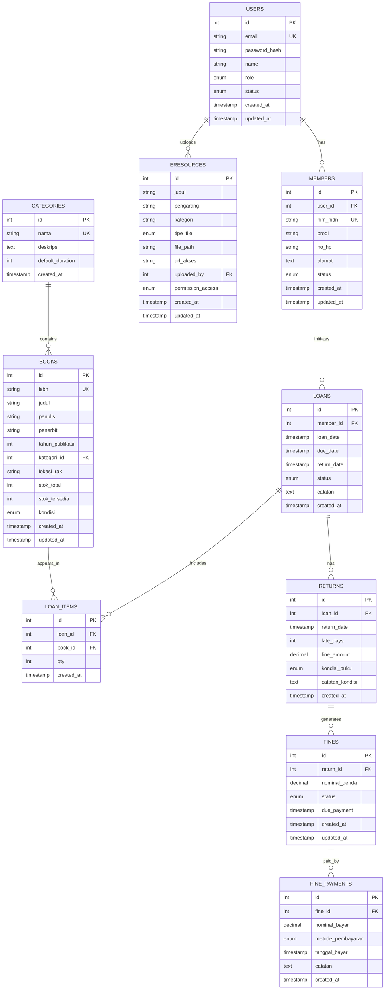

# USTEK KELOMPOK 6 - SISTEM INFORMASI PERPUSTAKAAN BERBASIS WEB
## UNIVERSITAS KEBANGSAAN REPUBLIK INDONESIA

---

## 📋 DOKUMEN LENGKAP

**Nama Proyek**: Sistem Informasi Perpustakaan Berbasis Web (SIPERPUS)  
**Klien**: Universitas Kebangsaan Republik Indonesia  
**Pengembang**: Kelompok 6 – Program Studi Sistem Informasi  
**Versi**: 2.0  
**Tanggal Penyusunan**: 10 Juni 2026  
**Status**: Final  

---

## 👥 IDENTITAS TIM PELAKSANA (KELOMPOK 6)

| No | Nama | Posisi | NIM/NIDN | Tugas Utama |
|----|------|--------|----------|------------|
| 1 | **Muhammad Akmal Palqah** | Project Leader / Project Manager | - | Koordinasi tim, penjadwalan, komunikasi stakeholder, validasi deliverable |
| 2 | **Rahayu Padilah** | System Analyst | - | Analisis kebutuhan, proses bisnis, penyusunan SRS, desain database (ERD/LRS) |
| 3 | **Ilham Al Munawar** | Programmer Front-end | - | Implementasi UI/UX (Bootstrap), integrasi API ke tampilan |
| 4 | **Muhammad Fajar Nurjaman** | Programmer Back-end | - | Implementasi backend, API, autentikasi, logika sirkulasi & denda |
| 5 | **Riphan Romadlon** | QA & Dokumentasi | - | Black-box testing, test report, dokumentasi UAT dan BAST |

---

## 👨‍💼 DATA STAKEHOLDER PERPUSTAKAAN

| No | Nama | Jabatan | Peran pada Kegiatan | Kontak |
|----|------|---------|---------------------|--------|
| 1 | **Syahid Rohidin** | Kepala Perpustakaan | Narasumber utama, validasi kebutuhan, persetujuan UAT | - |
| 2 | **Yayan Skakmat** | Staf Administrasi Perpustakaan | Narasumber operasional, pendamping observasi, pelaksana uji coba UAT | - |

---

# BAGIAN 1: SPESIFIKASI KEBUTUHAN PERANGKAT LUNAK (SRS)

## 1. PENDAHULUAN

### 1.1 Tujuan Dokumen
Dokumen ini mendefisikan spesifikasi kebutuhan fungsional dan non-fungsional untuk pengembangan Sistem Informasi Perpustakaan Berbasis Web yang akan diimplementasikan di Universitas Kebangsaan Republik Indonesia.

### 1.2 Cakupan Proyek
Sistem yang akan dibangun mencakup:
- ✅ Modul autentikasi dan manajemen pengguna
- ✅ Katalog online (OPAC - Online Public Access Catalog)
- ✅ Modul sirkulasi (peminjaman & pengembalian)
- ✅ Sistem perhitungan denda otomatis
- ✅ Modul e-resources (e-book, jurnal)
- ✅ Dashboard monitoring dan laporan

### 1.3 Referensi Dokumen
| No | Dokumen | Versi | Keterangan |
|----|---------|-------|-----------|
| 1 | KAK Perpustakaan UKRI | 1.0 | Kerangka Acuan Kerja |
| 2 | Notulen Wawancara | 1.0 | Hasil analisis kebutuhan (20 April 2026) |
| 3 | Form Observasi Proses Bisnis | 1.0 | Dokumentasi As-Is |
| 4 | Daftar Hadir Kegiatan | 1.0 | Bukti keterlibatan stakeholder |

---

## 2. GAMBARAN UMUM SISTEM

### 2.1 Konteks Sistem
Perpustakaan Universitas Kebangsaan Republik Indonesia saat ini masih menggunakan sistem manual dalam mengelola koleksi buku, peminjaman, dan pengembalian. Hal ini menyebabkan:

**Masalah Saat Ini (As-Is)**:
- ❌ Risiko kehilangan data historis
- ❌ Kesalahan perhitungan denda (manual)
- ❌ Pencarian koleksi tidak efisien
- ❌ Laporan membutuhkan waktu lama
- ❌ Sulit tracking riwayat peminjaman
- ❌ Ketersediaan stok tidak akurat

**Solusi (To-Be)**: Sistem Informasi Perpustakaan Berbasis Web yang terintegrasi dan otomatis.

### 2.2 Stakeholder Utama
| Stakeholder | Peran | Kebutuhan |
|-------------|------|----------|
| Kepala Perpustakaan (Syahid Rohidin) | Validasi & approval | Laporan monitoring, kontrol akses, statistik |
| Staf Perpustakaan (Yayan Skakmat) | Operator | Kemudahan pencatatan, filter cepat, UI intuitif |
| Mahasiswa/Dosen | Member/User | OPAC user-friendly, akses e-resources, tracking pinjaman |
| Admin IT | Support | Backup, security, monitoring, maintenance |

### 2.3 Aktor Sistem
1. **Admin** → Mengelola data buku, anggota, laporan, dan sistem
2. **Pustakawan** → Mengelola sirkulasi (pinjam/kembali), denda
3. **Anggota (Member)** → Pencarian buku, riwayat peminjaman, e-resources

### 2.4 Batasan & Asumsi

**Batasan:**
- Hanya mendukung role: Admin, Pustakawan, Member
- Pembayaran denda via offline (tunai/cheque)
- Tidak terintegrasi langsung dengan sistem akademik (sync manual/import)
- Max file upload: 100MB per file
- Concurrent users: minimal 50 user

**Asumsi:**
- Koneksi internet stabil (minimal 1 Mbps)
- Member sudah terdaftar di sistem akademik
- Perpustakaan buka 24/7 (akses sistem)
- Server tersedia di local atau cloud infrastructure

---

## 3. KEBUTUHAN FUNGSIONAL

### 3.1 Modul Autentikasi & Manajemen Pengguna

#### UC-001: Login Sistem
**Aktor**: Semua pengguna (Admin, Pustakawan, Member)  
**Precondition**: User terdaftar di database  

**Main Flow**:
1. User membuka halaman login (`/login`)
2. User memasukkan email & password
3. Sistem validasi kredensial (bcrypt comparison)
4. Jika valid → Set session (30 menit timeout) & redirect ke dashboard
5. Jika invalid → Tampilkan pesan error (max 3x attempts = lock 15 menit)
6. Sistem log login attempt (untuk audit trail)

**Postcondition**: User berhasil masuk sesuai role-nya

**Validasi**:
- Email format valid
- Password tidak kosong
- Case-sensitive password

#### UC-002: Logout
**Aktor**: Semua pengguna  
**Main Flow**:
1. User klik tombol logout
2. Sistem destroy session & clear cookies
3. Redirect ke halaman login

#### UC-003: Reset Password
**Aktor**: User yang lupa password  
**Flow**:
1. User klik "Lupa Password" di login page
2. Input email → sistem send reset link via email
3. Link valid 24 jam
4. User buat password baru
5. Sistem validasi strength & update password

#### UC-004: Manajemen Data Pengguna (Admin Only)
**Aktor**: Admin  
**Fitur**:
- CRUD pengguna (Create, Read, Update, Delete)
- Assign role (Admin, Pustakawan, Member)
- Aktivasi/deaktivasi akun
- Reset password (force reset)
- View login history & activity

**Validasi**:
- Email harus unik
- Password minimal 8 karakter (upper, lower, number, special char)
- Role hanya admin yang bisa assign

---

### 3.2 Modul Data Anggota

#### UC-005: Manajemen Data Anggota (Admin & Pustakawan)
**Field Anggota**:
- NIM/NIDN (Nomor Identitas Mahasiswa/Dosen) - UK
- Nama lengkap
- Program Studi/Fakultas
- No. HP
- Alamat
- Status keanggotaan (aktif/non-aktif/suspend)
- Tanggal daftar

**Fitur**:
- ✅ CRUD data anggota
- ✅ Pencarian anggota by NIM/nama
- ✅ Export data anggota (PDF/Excel)
- ✅ Suspend anggota (if tunggakan denda > limit)
- ✅ Bulk import dari CSV

---

### 3.3 Modul Data Buku (Katalog)

#### UC-006: Manajemen Data Buku (Admin)
**Field Buku**:
- ISBN (unik) - Format valid: 10 atau 13 digit
- Judul
- Penulis
- Penerbit
- Tahun publikasi
- Kategori/Genre (FK)
- Lokasi rak (format: A-01-03)
- Stok total & stok tersedia
- Kondisi fisik (baik/rusak ringan/rusak berat)

**Fitur**:
- ✅ CRUD data buku
- ✅ Bulk import dari Excel
- ✅ Upload cover buku
- ✅ Update stok otomatis saat peminjaman/pengembalian
- ✅ Pencarian duplikat ISBN

#### UC-007: Manajemen Kategori Buku
**Fitur**:
- ✅ Daftar kategori standar (Fiksi, Non-Fiksi, Referensi, dll)
- ✅ CRUD kategori
- ✅ Soft delete untuk kategori yang sudah digunakan

---

### 3.4 Modul OPAC (Online Public Access Catalog)

#### UC-008: Pencarian Buku (Public Access)
**Aktor**: Semua user (Member, Admin, Pustakawan)  
**Fitur Pencarian**:
- ✅ By judul (LIKE search)
- ✅ By penulis
- ✅ By kategori (dropdown filter)
- ✅ By tahun publikasi (range)
- ✅ Advanced search (kombinasi filter)

**Hasil Pencarian**:
- List buku dengan pagination (10 per halaman)
- Tampilkan: Judul, Penulis, Kategori, Stok tersedia, Status
- Sort by: Judul (A-Z), Tahun (terbaru), Popularitas

**Target Performance**: Search response < 2 detik (dengan indexing)

#### UC-009: Lihat Detail Buku
**Fitur**:
- ✅ Cover buku, metadata lengkap
- ✅ Daftar peminjam saat ini
- ✅ Tombol "Request peminjaman" jika member login

---

### 3.5 Modul Sirkulasi (Peminjaman & Pengembalian)

#### UC-010: Peminjaman Buku
**Aktor**: Pustakawan  
**Precondition**:
- ✅ Member aktif & tidak suspend
- ✅ Buku tersedia (stok > 0)
- ✅ Member belum mencapai limit peminjaman (max 5 buku)

**Main Flow**:
1. Pustakawan input NIM anggota
2. Sistem cek status anggota & denda tertunggak
3. Pustakawan pilih buku yang akan dipinjam
4. Sistem validasi stok & limit
5. Sistem hitung due date (default: 14 hari, per kategori dapat override)
6. Create transaksi peminjaman & update stok
7. Cetak bukti peminjaman

**Postcondition**:
- LOANS & LOAN_ITEMS record created
- BOOKS.stok_tersedia -= 1
- Bukti peminjaman dicetak

#### UC-011: Perpanjangan Peminjaman (Optional)
**Aktor**: Member atau Pustakawan  
**Condition**:
- ✅ Peminjaman belum jatuh tempo
- ✅ Belum ada pemesanan buku dari member lain
- ✅ Max 1x perpanjangan per loan

**Flow**:
1. Request perpanjangan (+7 hari)
2. Sistem validasi kondisi
3. Update due date & catat history
4. Notify member

#### UC-012: Pengembalian Buku
**Aktor**: Pustakawan  
**Precondition**: Ada transaksi peminjaman aktif

**Main Flow**:
1. Pustakawan input/scan transaksi peminjaman (loan_id)
2. Sistem validate kondisi pengembalian (Normal/Rusak/Hilang)
3. Sistem validasi return date vs due_date
4. **Perhitungan Denda Otomatis**:
   ```
   IF return_date > due_date:
       late_days = return_date - due_date
       fine_amount = late_days × Rp 5.000 per hari
       (max cap: Rp 500.000 - optional)
   ELSE:
       fine_amount = 0
   ```
5. Create RETURNS record & auto-create FINES record (if late)
6. Update stok buku (stok_tersedia += 1) via trigger
7. Set LOANS.status = "returned"
8. Cetak bukti pengembalian

**Postcondition**:
- RETURNS record created
- FINES record created (if late)
- Bukti pengembalian dicetak

---

### 3.6 Modul Denda

#### UC-013: Manajemen Denda (Admin & Pustakawan)
**Fitur**:
- ✅ List denda belum lunas (real-time)
- ✅ Filter by: member, periode, status
- ✅ Suspend member otomatis jika denda > limit
- ✅ Export denda report

#### UC-014: Pembayaran Denda
**Aktor**: Pustakawan (recording)  
**Flow**:
1. Member datang & bayar tunai
2. Pustakawan cari denda member (by NIM)
3. Input nominal bayar
4. Sistem validasi nominal & update status
5. Create FINE_PAYMENTS record
6. Cetak kwitansi pembayaran
7. Un-suspend member (if all fines paid)

---

### 3.7 Modul E-Resources

#### UC-015: Upload E-Resources (Admin & Pustakawan)
**Fitur**:
- ✅ Upload file (PDF, ePub, Mobi, Doc)
- ✅ Input metadata: Judul, Pengarang, Kategori, Deskripsi
- ✅ Akses control: Public / Member Only / Admin Only
- ✅ Max file size: 100 MB per file

**Flow**:
1. Admin/Pustakawan klik "Upload E-Resource"
2. Pilih file & isi metadata
3. Sistem scan virus (optional)
4. Simpan file ke storage
5. Create record di database
6. Set permission akses

#### UC-016: Pencarian & Download E-Resources
**Aktor**: Member (dengan akses sesuai permission)  
**Fitur**:
- ✅ Search e-resource (sama seperti OPAC)
- ✅ Filter by tipe file
- ✅ Download dengan tracking
- ✅ Permission-based access

---

### 3.8 Modul Dashboard & Laporan

#### UC-017: Dashboard Admin
**Widgets/KPI**:
1. **Statistik Koleksi**:
   - Total buku
   - Total kategori
   - Buku terpopuler (top 5)
   - Buku dengan stok rendah (< 3)

2. **Statistik Keanggotaan**:
   - Total member aktif
   - Member baru bulan ini
   - Member dengan tunggakan denda

3. **Statistik Sirkulasi**:
   - Total peminjaman bulan ini
   - Pengembalian tepat waktu vs terlambat (%)
   - Rata-rata keterlambatan (hari)
   - Total denda tertagih vs tertunggak

4. **Chart/Grafik**:
   - Bar chart: Buku paling sering dipinjam
   - Pie chart: Distribusi kategori
   - Line chart: Trend peminjaman per bulan

#### UC-018: Dashboard Pustakawan
**Widgets** (limited):
- Transaksi hari ini
- Outstanding fines today
- Member dengan tunggakan
- Recent returns

#### UC-019: Dashboard Member
**Features**:
- My active loans
- Loan history
- My fines status
- Due dates countdown

#### UC-020: Laporan (Admin & Pustakawan)
**Tipe Laporan**:
1. **Laporan Sirkulasi**: Filter periode, export PDF/Excel
2. **Laporan Denda**: Status, total tertagih/terbayar
3. **Laporan Koleksi**: Per kategori, stok analysis
4. **Laporan Keanggotaan**: Status member, riwayat peminjaman
5. **Custom Report**: Report builder untuk admin

---

## 4. KEBUTUHAN NON-FUNGSIONAL

### 4.1 Keamanan (Security)

| Aspek | Requirement | Implementasi |
|-------|-------------|--------------|
| **Authentication** | Login dengan email & password | bcrypt hashing (salt 12), session timeout 30 menit |
| **Authorization** | Role-based access control (RBAC) | 3 role: Admin, Pustakawan, Member |
| **Data Protection** | Enkripsi data sensitif | TLS 1.3, bcrypt password, AES-256 sensitive fields |
| **Input Validation** | Validasi semua input | Server & client-side validation |
| **SQL Injection Prevention** | Prepared statement / ORM | Parameterized Query |
| **XSS Prevention** | Sanitasi output | HTML entity encoding, CSP header |
| **CSRF Protection** | Token CSRF | Setiap form include CSRF token |
| **Backup** | Backup database berkala | Daily backup, 7 hari versioning |
| **Audit Trail** | Log aktivitas penting | audit_log table |

### 4.2 Kinerja (Performance)

| Metric | Target | Cara Pencapaian |
|--------|--------|-----------------|
| **Response Time Pencarian** | < 2 detik | Database indexing (judul, penulis, ISBN) |
| **Response Time Laporan** | < 5 detik | Query optimization, caching |
| **Concurrent Users** | ≥ 50 user | Load balancing, connection pooling |
| **Uptime** | 99% | Monitoring, disaster recovery |
| **API Response** | < 500ms | Response caching |
| **Frontend Load** | < 3 detik | Minification, compression, CDN |

### 4.3 Ketersediaan & Reliabilitas

| Requirement | Detail |
|-------------|--------|
| **Availability** | 24/7 akses web (99% uptime) |
| **Disaster Recovery** | RPO: 1 jam, RTO: 30 menit |
| **Data Integrity** | ACID compliance, transaction rollback |
| **Audit Trail** | Log semua transaksi penting |
| **Error Handling** | Graceful error page, error logging |

### 4.4 Usability (User Experience)

| Aspek | Requirement |
|------|-------------|
| **UI/UX Design** | Simple, clean, intuitive (Bootstrap/Material) |
| **Mobile Responsiveness** | Support mobile (responsive design) |
| **Language** | Bahasa Indonesia |
| **Accessibility** | WCAG 2.1 AA compliance |
| **Documentation** | User manual, admin guide (PDF) |
| **Training** | Training session untuk staff |

### 4.5 Maintainability

| Aspek | Requirement |
|-------|-------------|
| **Code Quality** | Clean code, SOLID principles |
| **Documentation** | Code comments, API docs (Swagger) |
| **Version Control** | Git with Git Flow strategy |
| **CI/CD** | Automated test & deployment |
| **Monitoring** | Error tracking (Sentry), metrics (Prometheus) |

---

# BAGIAN 2: DATABASE DESIGN (ERD & STRUKTUR)

## 5. ERD (Entity Relationship Diagram)

### 5.1 ERD Diagram - Mermaid Format



### 5.2 Penjelasan Entity & Relationships

**USERS** → Account management
- 1 User : N Members (one-to-many)
- 1 User : N E-Resources uploads

**MEMBERS** → Anggota perpustakaan
- N Members : 1 User
- 1 Member : N Loans

**CATEGORIES** → Klasifikasi buku
- 1 Category : N Books

**BOOKS** → Koleksi buku
- N Books : 1 Category
- 1 Book : N Loan_Items

**LOANS** → Transaksi peminjaman
- N Loans : 1 Member
- 1 Loan : N Loan_Items
- 1 Loan : 0..1 Returns

**LOAN_ITEMS** → Detail peminjaman
- N Loan_Items : 1 Loan
- N Loan_Items : 1 Book

**RETURNS** → Pengembalian & denda
- N Returns : 1 Loan
- 1 Return : N Fines

**FINES** → Manajemen denda
- N Fines : 1 Return
- 1 Fine : N Fine_Payments

**FINE_PAYMENTS** → Pembayaran denda
- N Fine_Payments : 1 Fine

**ERESOURCES** → Dokumen digital
- N EResources : 1 User (uploaded_by)

---

## 6. STRUKTUR DATABASE LENGKAP

### 6.1 Tabel: USERS

```sql
CREATE TABLE users (
    id INT PRIMARY KEY AUTO_INCREMENT,
    email VARCHAR(100) UNIQUE NOT NULL,
    password_hash VARCHAR(255) NOT NULL,
    name VARCHAR(100) NOT NULL,
    role ENUM('admin', 'pustakawan', 'member') NOT NULL,
    status ENUM('aktif', 'non_aktif', 'suspend') NOT NULL DEFAULT 'aktif',
    created_at TIMESTAMP DEFAULT CURRENT_TIMESTAMP,
    updated_at TIMESTAMP ON UPDATE CURRENT_TIMESTAMP,
    INDEX idx_role (role),
    INDEX idx_status (status)
);
```

| Column | Type | Constraint | Deskripsi |
|--------|------|-----------|-----------|
| id | INT | PK, AUTO_INCREMENT | Unique identifier |
| email | VARCHAR(100) | UNIQUE, NOT NULL | Email user (login) |
| password_hash | VARCHAR(255) | NOT NULL | Hashed password (bcrypt) |
| name | VARCHAR(100) | NOT NULL | Nama lengkap |
| role | ENUM | NOT NULL | admin, pustakawan, member |
| status | ENUM | NOT NULL | aktif, non_aktif, suspend |
| created_at | TIMESTAMP | DEFAULT | Waktu pembuatan |
| updated_at | TIMESTAMP | ON UPDATE | Waktu update terakhir |

---

### 6.2 Tabel: MEMBERS

```sql
CREATE TABLE members (
    id INT PRIMARY KEY AUTO_INCREMENT,
    user_id INT NOT NULL,
    nim_nidn VARCHAR(20) UNIQUE NOT NULL,
    prodi VARCHAR(100) NOT NULL,
    no_hp VARCHAR(15) NOT NULL,
    alamat TEXT NOT NULL,
    status ENUM('aktif', 'non_aktif', 'suspend') NOT NULL DEFAULT 'aktif',
    created_at TIMESTAMP DEFAULT CURRENT_TIMESTAMP,
    updated_at TIMESTAMP ON UPDATE CURRENT_TIMESTAMP,
    FOREIGN KEY (user_id) REFERENCES users(id) ON DELETE CASCADE,
    INDEX idx_status (status),
    INDEX idx_prodi (prodi)
);
```

| Column | Type | Constraint | Deskripsi |
|--------|------|-----------|-----------|
| id | INT | PK, AUTO_INCREMENT | Unique identifier |
| user_id | INT | FK → users(id) | Reference ke users |
| nim_nidn | VARCHAR(20) | UNIQUE, NOT NULL | Nomor identitas |
| prodi | VARCHAR(100) | NOT NULL | Program studi |
| no_hp | VARCHAR(15) | NOT NULL | Nomor HP |
| alamat | TEXT | NOT NULL | Alamat lengkap |
| status | ENUM | NOT NULL | aktif, non_aktif, suspend |
| created_at | TIMESTAMP | DEFAULT | Waktu daftar |
| updated_at | TIMESTAMP | ON UPDATE | Update terakhir |

---

### 6.3 Tabel: CATEGORIES

```sql
CREATE TABLE categories (
    id INT PRIMARY KEY AUTO_INCREMENT,
    nama VARCHAR(100) UNIQUE NOT NULL,
    deskripsi TEXT,
    default_duration INT NOT NULL DEFAULT 14,
    created_at TIMESTAMP DEFAULT CURRENT_TIMESTAMP,
    INDEX idx_nama (nama)
);
```

| Column | Type | Constraint | Deskripsi |
|--------|------|-----------|-----------|
| id | INT | PK, AUTO_INCREMENT | Unique identifier |
| nama | VARCHAR(100) | UNIQUE, NOT NULL | Nama kategori |
| deskripsi | TEXT | | Deskripsi kategori |
| default_duration | INT | NOT NULL | Default durasi peminjaman (hari) |
| created_at | TIMESTAMP | DEFAULT | Waktu pembuatan |

---

### 6.4 Tabel: BOOKS

```sql
CREATE TABLE books (
    id INT PRIMARY KEY AUTO_INCREMENT,
    isbn VARCHAR(20) UNIQUE NOT NULL,
    judul VARCHAR(255) NOT NULL,
    penulis VARCHAR(255) NOT NULL,
    penerbit VARCHAR(100) NOT NULL,
    tahun_publikasi INT NOT NULL,
    kategori_id INT NOT NULL,
    lokasi_rak VARCHAR(20),
    stok_total INT NOT NULL DEFAULT 1,
    stok_tersedia INT NOT NULL DEFAULT 1,
    kondisi ENUM('baik', 'rusak_ringan', 'rusak_berat') NOT NULL DEFAULT 'baik',
    created_at TIMESTAMP DEFAULT CURRENT_TIMESTAMP,
    updated_at TIMESTAMP ON UPDATE CURRENT_TIMESTAMP,
    FOREIGN KEY (kategori_id) REFERENCES categories(id) ON DELETE RESTRICT,
    INDEX idx_judul (judul),
    INDEX idx_penulis (penulis),
    INDEX idx_stok_tersedia (stok_tersedia),
    INDEX idx_tahun_publikasi (tahun_publikasi)
);
```

| Column | Type | Constraint | Deskripsi |
|--------|------|-----------|-----------|
| id | INT | PK, AUTO_INCREMENT | Unique identifier |
| isbn | VARCHAR(20) | UNIQUE, NOT NULL | ISBN buku (10 atau 13 digit) |
| judul | VARCHAR(255) | NOT NULL | Judul buku |
| penulis | VARCHAR(255) | NOT NULL | Nama penulis |
| penerbit | VARCHAR(100) | NOT NULL | Nama penerbit |
| tahun_publikasi | INT | NOT NULL | Tahun terbit |
| kategori_id | INT | FK → categories(id) | Referensi kategori |
| lokasi_rak | VARCHAR(20) | | Format: A-01-03 (area-row-col) |
| stok_total | INT | NOT NULL | Total stok |
| stok_tersedia | INT | NOT NULL | Stok tersedia untuk dipinjam |
| kondisi | ENUM | NOT NULL | Kondisi fisik buku |
| created_at | TIMESTAMP | DEFAULT | Waktu input |
| updated_at | TIMESTAMP | ON UPDATE | Update terakhir |

---

### 6.5 Tabel: LOANS

```sql
CREATE TABLE loans (
    id INT PRIMARY KEY AUTO_INCREMENT,
    member_id INT NOT NULL,
    loan_date TIMESTAMP NOT NULL DEFAULT CURRENT_TIMESTAMP,
    due_date TIMESTAMP NOT NULL,
    return_date TIMESTAMP NULL,
    status ENUM('active', 'returned', 'overdue') NOT NULL DEFAULT 'active',
    catatan TEXT,
    created_at TIMESTAMP DEFAULT CURRENT_TIMESTAMP,
    FOREIGN KEY (member_id) REFERENCES members(id) ON DELETE RESTRICT,
    INDEX idx_member_id (member_id),
    INDEX idx_status (status),
    INDEX idx_due_date (due_date)
);
```

| Column | Type | Constraint | Deskripsi |
|--------|------|-----------|-----------|
| id | INT | PK, AUTO_INCREMENT | Unique identifier |
| member_id | INT | FK → members(id) | Reference ke member |
| loan_date | TIMESTAMP | NOT NULL | Tanggal peminjaman |
| due_date | TIMESTAMP | NOT NULL | Tanggal jatuh tempo |
| return_date | TIMESTAMP | NULLABLE | Tanggal pengembalian aktual |
| status | ENUM | NOT NULL | active, returned, overdue |
| catatan | TEXT | | Catatan tambahan |
| created_at | TIMESTAMP | DEFAULT | Waktu record |

---

### 6.6 Tabel: LOAN_ITEMS

```sql
CREATE TABLE loan_items (
    id INT PRIMARY KEY AUTO_INCREMENT,
    loan_id INT NOT NULL,
    book_id INT NOT NULL,
    qty INT NOT NULL DEFAULT 1,
    created_at TIMESTAMP DEFAULT CURRENT_TIMESTAMP,
    FOREIGN KEY (loan_id) REFERENCES loans(id) ON DELETE CASCADE,
    FOREIGN KEY (book_id) REFERENCES books(id) ON DELETE RESTRICT,
    UNIQUE KEY uq_loan_book (loan_id, book_id)
);
```

| Column | Type | Constraint | Deskripsi |
|--------|------|-----------|-----------|
| id | INT | PK, AUTO_INCREMENT | Unique identifier |
| loan_id | INT | FK → loans(id) | Reference ke loans |
| book_id | INT | FK → books(id) | Reference ke books |
| qty | INT | NOT NULL | Jumlah buku |
| created_at | TIMESTAMP | DEFAULT | Waktu pembuatan |

---

### 6.7 Tabel: RETURNS

```sql
CREATE TABLE returns (
    id INT PRIMARY KEY AUTO_INCREMENT,
    loan_id INT NOT NULL UNIQUE,
    return_date TIMESTAMP NOT NULL DEFAULT CURRENT_TIMESTAMP,
    late_days INT NOT NULL DEFAULT 0,
    fine_amount DECIMAL(10,2) NOT NULL DEFAULT 0,
    kondisi_buku ENUM('baik', 'rusak_ringan', 'rusak_berat', 'hilang') NOT NULL,
    catatan_kondisi TEXT,
    created_at TIMESTAMP DEFAULT CURRENT_TIMESTAMP,
    FOREIGN KEY (loan_id) REFERENCES loans(id) ON DELETE RESTRICT,
    INDEX idx_loan_id (loan_id)
);
```

| Column | Type | Constraint | Deskripsi |
|--------|------|-----------|-----------|
| id | INT | PK, AUTO_INCREMENT | Unique identifier |
| loan_id | INT | FK → loans(id) | Reference ke loans |
| return_date | TIMESTAMP | NOT NULL | Tanggal pengembalian |
| late_days | INT | NOT NULL | Jumlah hari terlambat |
| fine_amount | DECIMAL(10,2) | NOT NULL | Nominal denda (Rp) |
| kondisi_buku | ENUM | NOT NULL | Kondisi saat dikembalikan |
| catatan_kondisi | TEXT | | Catatan detail kondisi |
| created_at | TIMESTAMP | DEFAULT | Waktu record |

---

### 6.8 Tabel: FINES

```sql
CREATE TABLE fines (
    id INT PRIMARY KEY AUTO_INCREMENT,
    return_id INT NOT NULL,
    nominal_denda DECIMAL(10,2) NOT NULL,
    status ENUM('unpaid', 'partial', 'paid') NOT NULL DEFAULT 'unpaid',
    due_payment TIMESTAMP,
    created_at TIMESTAMP DEFAULT CURRENT_TIMESTAMP,
    updated_at TIMESTAMP ON UPDATE CURRENT_TIMESTAMP,
    FOREIGN KEY (return_id) REFERENCES returns(id) ON DELETE RESTRICT,
    INDEX idx_status (status),
    INDEX idx_due_payment (due_payment)
);
```

| Column | Type | Constraint | Deskripsi |
|--------|------|-----------|-----------|
| id | INT | PK, AUTO_INCREMENT | Unique identifier |
| return_id | INT | FK → returns(id) | Reference ke returns |
| nominal_denda | DECIMAL(10,2) | NOT NULL | Nominal total denda |
| status | ENUM | NOT NULL | unpaid, partial, paid |
| due_payment | TIMESTAMP | | Deadline pembayaran |
| created_at | TIMESTAMP | DEFAULT | Waktu record |
| updated_at | TIMESTAMP | ON UPDATE | Update terakhir |

---

### 6.9 Tabel: FINE_PAYMENTS

```sql
CREATE TABLE fine_payments (
    id INT PRIMARY KEY AUTO_INCREMENT,
    fine_id INT NOT NULL,
    nominal_bayar DECIMAL(10,2) NOT NULL,
    metode_pembayaran ENUM('tunai', 'cheque', 'transfer') NOT NULL DEFAULT 'tunai',
    tanggal_bayar TIMESTAMP NOT NULL DEFAULT CURRENT_TIMESTAMP,
    catatan TEXT,
    created_at TIMESTAMP DEFAULT CURRENT_TIMESTAMP,
    FOREIGN KEY (fine_id) REFERENCES fines(id) ON DELETE RESTRICT,
    INDEX idx_fine_id (fine_id),
    INDEX idx_tanggal_bayar (tanggal_bayar)
);
```

| Column | Type | Constraint | Deskripsi |
|--------|------|-----------|-----------|
| id | INT | PK, AUTO_INCREMENT | Unique identifier |
| fine_id | INT | FK → fines(id) | Reference ke fines |
| nominal_bayar | DECIMAL(10,2) | NOT NULL | Jumlah uang dibayar |
| metode_pembayaran | ENUM | NOT NULL | Metode pembayaran |
| tanggal_bayar | TIMESTAMP | NOT NULL | Waktu pembayaran |
| catatan | TEXT | | Keterangan tambahan |
| created_at | TIMESTAMP | DEFAULT | Waktu record |

---

### 6.10 Tabel: ERESOURCES

```sql
CREATE TABLE eresources (
    id INT PRIMARY KEY AUTO_INCREMENT,
    judul VARCHAR(255) NOT NULL,
    pengarang VARCHAR(255),
    kategori VARCHAR(100),
    tipe_file ENUM('pdf', 'epub', 'mobi', 'doc', 'link') NOT NULL,
    file_path VARCHAR(255),
    url_akses VARCHAR(255),
    uploaded_by INT,
    permission_access ENUM('public', 'member_only', 'admin_only') NOT NULL DEFAULT 'member_only',
    created_at TIMESTAMP DEFAULT CURRENT_TIMESTAMP,
    updated_at TIMESTAMP ON UPDATE CURRENT_TIMESTAMP,
    FOREIGN KEY (uploaded_by) REFERENCES users(id) ON DELETE SET NULL,
    INDEX idx_kategori (kategori),
    INDEX idx_permission_access (permission_access)
);
```

| Column | Type | Constraint | Deskripsi |
|--------|------|-----------|-----------|
| id | INT | PK, AUTO_INCREMENT | Unique identifier |
| judul | VARCHAR(255) | NOT NULL | Judul e-resource |
| pengarang | VARCHAR(255) | | Nama pengarang |
| kategori | VARCHAR(100) | | Kategori (e-book, jurnal, dll) |
| tipe_file | ENUM | NOT NULL | Tipe file/format |
| file_path | VARCHAR(255) | NULLABLE | Path file di server |
| url_akses | VARCHAR(255) | NULLABLE | URL akses (jika link) |
| uploaded_by | INT | FK → users(id) | User yang upload |
| permission_access | ENUM | NOT NULL | Siapa yang bisa akses |
| created_at | TIMESTAMP | DEFAULT | Waktu upload |
| updated_at | TIMESTAMP | ON UPDATE | Update terakhir |

---

### 6.11 Tabel: AUDIT_LOG (Optional)

```sql
CREATE TABLE audit_log (
    id BIGINT PRIMARY KEY AUTO_INCREMENT,
    user_id INT,
    action VARCHAR(100) NOT NULL,
    table_name VARCHAR(50) NOT NULL,
    record_id INT,
    old_value JSON,
    new_value JSON,
    ip_address VARCHAR(45),
    timestamp TIMESTAMP DEFAULT CURRENT_TIMESTAMP,
    FOREIGN KEY (user_id) REFERENCES users(id) ON DELETE SET NULL,
    INDEX idx_timestamp (timestamp),
    INDEX idx_action (action)
);
```

---

## 7. DATABASE TRIGGERS (Untuk Automation)

### 7.1 Trigger: Update Book Stock on Loan

```sql
CREATE TRIGGER update_book_stock_on_loan
AFTER INSERT ON loan_items
FOR EACH ROW
BEGIN
    UPDATE books 
    SET stok_tersedia = stok_tersedia - NEW.qty
    WHERE id = NEW.book_id;
END;
```

### 7.2 Trigger: Update Book Stock on Return

```sql
CREATE TRIGGER update_book_stock_on_return
AFTER INSERT ON returns
FOR EACH ROW
BEGIN
    UPDATE books 
    SET stok_tersedia = stok_tersedia + 1
    WHERE id = (
        SELECT book_id FROM loan_items 
        WHERE loan_id = NEW.loan_id LIMIT 1
    );
END;
```

### 7.3 Trigger: Create Fine Record on Late Return

```sql
CREATE TRIGGER create_fine_on_return
AFTER INSERT ON returns
FOR EACH ROW
BEGIN
    IF NEW.late_days > 0 THEN
        INSERT INTO fines (return_id, nominal_denda, status, due_payment, created_at)
        VALUES (NEW.id, NEW.fine_amount, 'unpaid', 
                DATE_ADD(NEW.return_date, INTERVAL 7 DAY), NOW());
    END IF;
END;
```

---

## 8. DATABASE VIEWS (Untuk Query Simplified)

### 8.1 View: Member Loan History

```sql
CREATE VIEW member_loan_history AS
SELECT 
    m.nim_nidn,
    m.nama,
    b.judul,
    b.isbn,
    l.loan_date,
    l.due_date,
    l.status,
    CASE 
        WHEN l.status = 'active' AND l.due_date < CURDATE() THEN 'OVERDUE'
        WHEN l.status = 'active' AND l.due_date >= CURDATE() THEN 'ACTIVE'
        ELSE 'RETURNED'
    END as loan_status,
    DATEDIFF(CURDATE(), l.due_date) as days_overdue
FROM loans l
JOIN members m ON l.member_id = m.id
JOIN loan_items li ON l.id = li.loan_id
JOIN books b ON li.book_id = b.id
ORDER BY l.loan_date DESC;
```

### 8.2 View: Outstanding Fines

```sql
CREATE VIEW outstanding_fines AS
SELECT 
    m.nim_nidn,
    m.nama,
    COUNT(f.id) as total_fines,
    SUM(f.nominal_denda) as total_denda,
    COALESCE(SUM(fp.nominal_bayar), 0) as total_paid,
    (SUM(f.nominal_denda) - COALESCE(SUM(fp.nominal_bayar), 0)) as remaining_balance
FROM fines f
JOIN returns r ON f.return_id = r.id
JOIN loans l ON r.loan_id = l.id
JOIN members m ON l.member_id = m.id
LEFT JOIN fine_payments fp ON f.id = fp.fine_id
WHERE f.status IN ('unpaid', 'partial')
GROUP BY f.id
ORDER BY m.nim_nidn;
```

### 8.3 View: Book Availability

```sql
CREATE VIEW book_availability AS
SELECT 
    b.isbn,
    b.judul,
    b.penulis,
    c.nama as kategori,
    b.stok_total,
    b.stok_tersedia,
    (SELECT COUNT(*) FROM loan_items li 
     JOIN loans l ON li.loan_id = l.id 
     WHERE li.book_id = b.id AND l.status = 'active') as currently_borrowed
FROM books b
LEFT JOIN categories c ON b.kategori_id = c.id
ORDER BY b.stok_tersedia DESC;
```

---

# BAGIAN 3: ACCEPTANCE CRITERIA & TIMELINE

## 9. ACCEPTANCE CRITERIA

### 9.1 Functional Acceptance
- [ ] Semua 20 UC berjalan sesuai spesifikasi
- [ ] Tidak ada critical/blocker bug pada final testing
- [ ] Data integrity terjaga (no data loss)
- [ ] All validations working correctly
- [ ] Database triggers functioning properly

### 9.2 Non-Functional Acceptance
- [ ] Response time pencarian < 2 detik (95 percentile)
- [ ] Response time laporan < 5 detik
- [ ] Uptime 99% dalam 1 bulan production
- [ ] Backup berjalan otomatis & restore tested
- [ ] Security audit passed
- [ ] Performance test dengan 50 concurrent users passed

### 9.3 User Acceptance
- [ ] Kepala Perpustakaan setuju fitur memenuhi kebutuhan ✓
- [ ] Staf perpustakaan terlatih & dapat operate independently
- [ ] User documentation complete & mudah dipahami
- [ ] Training session(s) completed dengan Q&A
- [ ] UAT passed dengan max 5 minor issues (resolved)

---

## 10. IMPLEMENTATION TIMELINE

### 10.1 Project Phases

| Phase | Duration | Activities | Deliverables |
|-------|----------|-----------|--------------|
| **Analysis & Design** | 3 minggu | Requirement gathering, SRS, ERD, mockup | SRS, ERD, UI prototype |
| **Development** | 5 minggu | Backend, Frontend, API development | Source code, API docs |
| **Testing** | 2 minggu | Unit, integration, system, UAT | Test report, bug list |
| **Deployment & Training** | 1 minggu | Production deployment, training, go-live | Live system, trained staff |
| **TOTAL** | **11 minggu** | | |

### 10.2 Detailed Weekly Schedule

```
MINGGU 1-3: Analysis & Design
├─ Minggu 1: Requirement gathering, stakeholder meeting
├─ Minggu 2: SRS writing, ERD design, database schema finalization
└─ Minggu 3: UI/UX mockup, API specification documentation

MINGGU 4-8: Development
├─ Minggu 4: Backend setup, database creation, API scaffolding
├─ Minggu 5-6: Core features (Auth, CRUD, OPAC)
├─ Minggu 7: Sirkulasi, Denda, E-Resources implementation
└─ Minggu 8: Dashboard, Reporting, API integration, unit testing

MINGGU 9-10: Testing & Refinement
├─ Minggu 9: Unit + Integration testing, bug fixing, security audit
└─ Minggu 10: UAT with stakeholders (Kepala Perpustakaan & Staf), final fixes

MINGGU 11: Deployment & Training
├─ Hari 1-2: Production deployment, configuration, final testing
├─ Hari 3-4: Staff training session (2x 2 jam) untuk Pustakawan & Admin
├─ Hari 5: Go-live, monitoring, support standup
```

### 10.3 Technology Stack

| Layer | Technology | Alasan |
|-------|-----------|--------|
| **Backend** | PHP 8.1+ Laravel 10 / Node.js Express | Mature, secure, good documentation |
| **Frontend** | HTML5, CSS3, Bootstrap 5, Vue.js 3 | Responsive, accessible, interactive |
| **Database** | MySQL 8.0 / PostgreSQL 14 | Reliable RDBMS, good support |
| **Server** | Nginx + Ubuntu 22.04 LTS | High performance, lightweight |
| **Version Control** | Git (GitHub/GitLab) | Standard, collaborative |
| **CI/CD** | GitHub Actions / Jenkins | Automated testing & deployment |
| **Caching** | Redis 7.x | Session & cache storage |
| **File Storage** | AWS S3 / Local disk | E-resource files |
| **Monitoring** | ELK Stack / Sentry | Error tracking, logs |
| **API Docs** | OpenAPI 3.0 (Swagger) | Standard documentation |

---

## 11. GLOSSARY

| Term | Definisi |
|------|----------|
| **OPAC** | Online Public Access Catalog - layanan pencarian katalog perpustakaan online |
| **Member** | Anggota perpustakaan (mahasiswa/dosen) |
| **Loan** | Transaksi peminjaman buku |
| **Due Date** | Tanggal jatuh tempo pengembalian buku |
| **Fine** | Denda keterlambatan pengembalian buku |
| **RBAC** | Role-Based Access Control - sistem otorisasi berbasis peran |
| **UC** | Use Case - skenario interaksi user dengan sistem |
| **UAT** | User Acceptance Testing - pengujian penerimaan pengguna |
| **ERD** | Entity Relationship Diagram - diagram hubungan tabel database |
| **SRS** | Software Requirements Specification - spesifikasi kebutuhan |
| **API** | Application Programming Interface - interface integrasi sistem |
| **TLS** | Transport Layer Security - protokol enkripsi komunikasi |
| **ACID** | Atomicity, Consistency, Isolation, Durability - property database |

---

## 12. DATA VOLUME & RETENTION

### 12.1 Proyeksi Data (1 Tahun Operasional)

| Data | Volume | Growth/Bulan | Storage |
|------|--------|--------------|---------|
| Total Buku | 10.000 | 100-500 | ~10 MB |
| Total Member | 5.000 | 100-200 | ~5 MB |
| Peminjaman/Tahun | ~180.000 | ~15.000 | ~50 MB |
| E-Resources | 500 files | 10-20 | ~50-100 GB |
| Audit Log | ~500.000 | ~40.000 | ~200 MB |
| **TOTAL** | | | **~100-150 GB** |

### 12.2 Data Retention Policy

| Data | Retensi | Alasan |
|------|---------|--------|
| Transaksi peminjaman | 7 tahun | Audit trail, historical analysis, legal requirement |
| Fine & Payment | 3 tahun | Legal requirement, tax compliance |
| Audit log | 1 tahun | Security, troubleshooting |
| System logs | 3 bulan | Troubleshooting, monitoring |
| Temp files | 7 hari | Cleanup, storage optimization |

---

## 13. RISK MANAGEMENT

### 13.1 Identifikasi Risiko

| # | Risiko | Probability | Impact | Mitigation |
|---|--------|-------------|--------|-----------|
| 1 | Delay implementasi fitur | Medium | High | Weekly status check, agile approach |
| 2 | Data loss pada database | Low | Critical | Daily backup, replication setup |
| 3 | Security vulnerability | Medium | High | Security audit, penetration test |
| 4 | Performance issue | Medium | High | Load testing, query optimization |
| 5 | Staff resistance to change | Medium | Medium | Training, documentation, support |
| 6 | Scope creep | High | Medium | Change control process, scope freeze |

### 13.2 Contingency Plan

- **Database failure**: Automatic failover to replica, restore from backup
- **Application crash**: Load balancer with multiple instances
- **Security breach**: Incident response team, data isolation, audit logging
- **Staff unavailable**: Cross-training team members
- **Vendor issues**: Escalation to vendor support, SLA enforcement

---

## 14. APPROVAL & SIGN-OFF

### 14.1 Penanda Tangan Dokumen

| Role | Nama | Tanda Tangan | Tanggal |
|------|------|-------------|---------|
| **Kepala Perpustakaan** | Syahid Rohidin | ________________ | ________ |
| **Staf Administrasi** | Yayan Skakmat | ________________ | ________ |
| **Project Manager** | Muhammad Akmal Palqah | ________________ | ________ |
| **System Analyst** | Rahayu Padilah | ________________ | ________ |
| **Front-end Developer** | Ilham Al Munawar | ________________ | ________ |
| **Back-end Developer** | Muhammad Fajar Nurjaman | ________________ | ________ |
| **QA & Dokumentasi** | Riphan Romadlon | ________________ | ________ |

---

## 15. DOKUMENTASI TAMBAHAN

### 15.1 File & Referensi Terkait

1. **SRS_SIPERPUS_LENGKAP.md** - Spesifikasi Kebutuhan Lengkap (40 KB)
2. **STRUKTUR_DATABASE.md** - Detail Database Structure (18 KB)
3. **ERD_MERMAID.md** - Entity Relationship Diagram (18 KB)
4. **BUKTI-USTEK-Kelompok-6-SIPERPUS.md** - Bukti Kegiatan & Dokumentasi

### 15.2 Lampiran (Terlampir Terpisah)

- [ ] Notulen Wawancara Stakeholder (20 April 2026)
- [ ] Form Observasi Proses Bisnis As-Is
- [ ] Daftar Hadir Kegiatan
- [ ] UI/UX Mockup Prototype
- [ ] API Specification (OpenAPI/Swagger)
- [ ] Test Case & Test Plan
- [ ] Deployment Checklist
- [ ] Training Materials (Slides & Handout)

---

## 16. CATATAN PENTING

### 16.1 Perpanjangan Scope (Jika Diperlukan)

Fitur-fitur berikut dapat ditambahkan di fase selanjutnya (Phase 2):
- [ ] Integration dengan sistem akademik (otomatis sync member)
- [ ] Email notification untuk due date reminder
- [ ] SMS notification untuk member
- [ ] Mobile app (iOS/Android native)
- [ ] QR code barcode scanning (untuk self-service)
- [ ] Reservation/booking system
- [ ] Recommendation engine (based on borrowing history)
- [ ] Fine amnesty/forgiveness (periodic)
- [ ] Integration dengan payment gateway (online payment)
- [ ] Advanced reporting dengan business intelligence

### 16.2 Post-Implementation Support

- **Duration**: 3 bulan (atau sesuai SLA)
- **Coverage**: Bug fixing, performance tuning, minor enhancements
- **Support Channel**: Email, ticket system, phone
- **Response Time**: Critical (1 hour), High (4 hours), Medium (8 hours)
- **Maintenance Window**: Setiap Minggu (Jumat, 23:00-02:00)

---

## 17. KESIMPULAN

Dokumen USTEK Kelompok 6 ini telah merangkum seluruh aspek pengembangan Sistem Informasi Perpustakaan Berbasis Web untuk Universitas Kebangsaan Republik Indonesia. 

**Deliverables Utama**:
✅ Spesifikasi kebutuhan fungsional (20 use cases)  
✅ Spesifikasi kebutuhan non-fungsional (Security, Performance, Availability)  
✅ Desain database lengkap (11 tabel, ERD, triggers, views)  
✅ Timeline implementasi (11 minggu)  
✅ Technology stack yang tepat  
✅ Acceptance criteria & UAT plan  
✅ Risk management & contingency  

Dokumen ini siap untuk digunakan sebagai pedoman pengembangan oleh Kelompok 6 dengan approval dari Kepala Perpustakaan dan stakeholder terkait.

---

**USTEK KELOMPOK 6**  
**Sistem Informasi Perpustakaan Berbasis Web**  
**Universitas Kebangsaan Republik Indonesia**  
**Versi: 2.0 | Status: FINAL | Tanggal: 10 Juni 2026**

---

*Dokumen ini merupakan hasil kolaborasi tim Kelompok 6 Program Studi Sistem Informasi dengan Stakeholder Perpustakaan UKRI. Setiap perubahan atau penambahan requirement harus melalui change control process dan approval dari stakeholder.*
